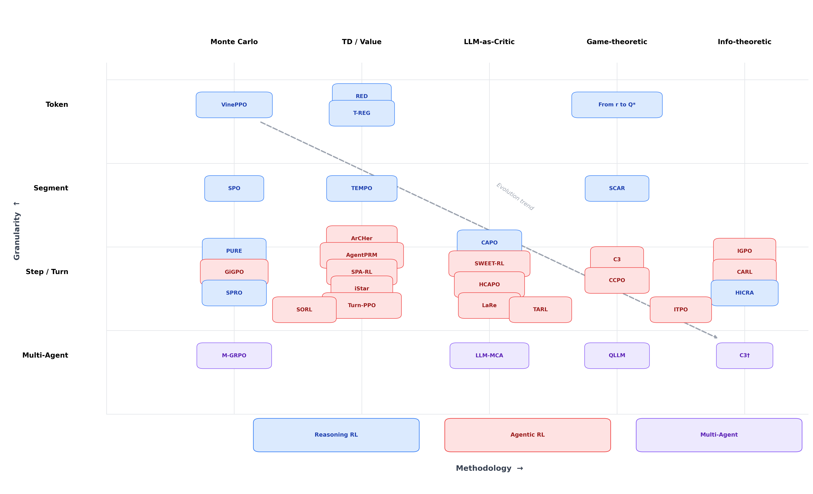
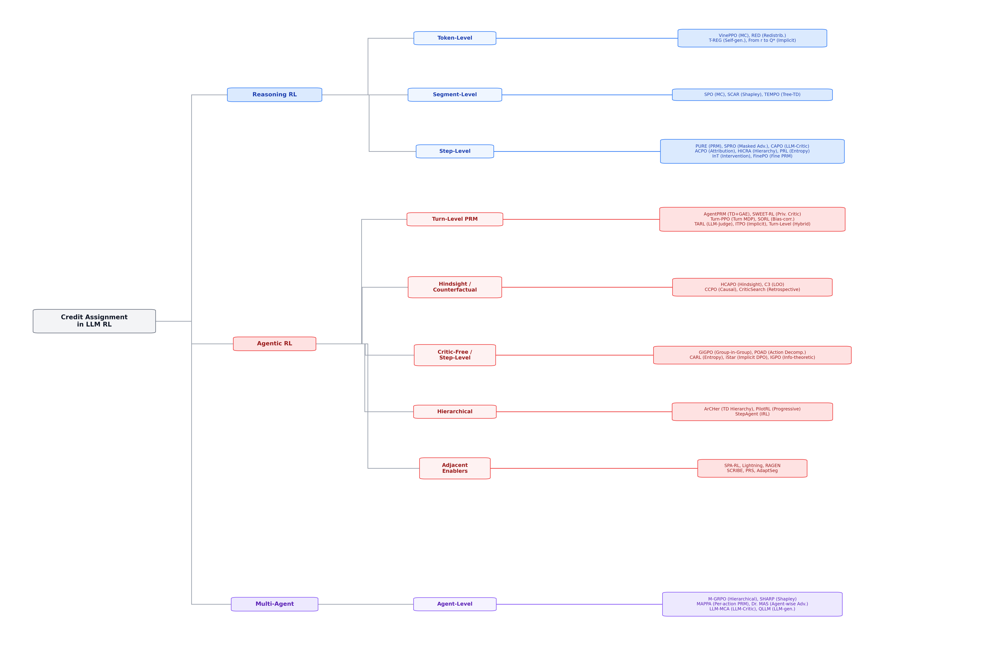

# Awesome Credit Assignment in LLM RL

[](https://awesome.re)
[](https://arxiv.org/abs/2604.09459)
[](https://opensource.org/licenses/MIT)
[](https://github.com/xxzcc/Awesome-Credit-Assignment-in-LLM-RL/pulls)

A curated list of papers and resources on **Credit Assignment in Reinforcement Learning for Large Language Models**, organized by our two-dimensional taxonomy (granularity x methodology).

This repository accompanies our survey paper:

> **From Reasoning to Agentic: Credit Assignment in Reinforcement Learning for Large Language Models**
>
> Chenchen Zhang
>
> [[Paper]](https://arxiv.org/abs/2604.09459)

We survey **47 credit assignment methods** (41 core, 6 adjacent enablers) published between 2024 and early 2026, covering reasoning RL, agentic RL, and multi-agent settings.

---

## Overview

<p align="center">
  
</p>

<p align="center">
  
</p>

Credit assignment (CA) in LLM RL addresses a fundamental question: when the only feedback is a sparse terminal reward, **which actions were responsible for the outcome?** This problem manifests in two regimes:

- **Reasoning RL**: Credit must be distributed across tokens and steps within a single chain-of-thought generation (500--30K+ tokens)
- **Agentic RL**: Multi-turn environment interaction introduces stochastic transitions, partial observability, and horizons of 100+ turns (100K--1M tokens)

Our taxonomy organizes methods along two axes:
- **Granularity**: Token / Segment / Step-Turn / Multi-Agent
- **Methodology**: Monte Carlo / Temporal Difference / LLM-as-Critic / Game-theoretic / Information-theoretic

---

## Updates

- **[2026.04]** First version of the survey released on arXiv. Repository created.

---

## Table of Contents

- [Foundational & Background](#foundational--background)
  - [Surveys & Overviews](#surveys--overviews)
  - [Classical RL Foundations](#classical-rl-foundations)
  - [RL Algorithms for LLMs](#rl-algorithms-for-llms)
  - [PRM Foundations](#prm-foundations)
- [Credit Assignment in Reasoning RL](#credit-assignment-in-reasoning-rl)
  - [Token-Level Methods](#token-level-methods)
  - [Segment-Level Methods](#segment-level-methods)
  - [Step-Level Methods](#step-level-methods)
- [Credit Assignment in Agentic RL](#credit-assignment-in-agentic-rl)
  - [Turn-Level Process Reward Models](#turn-level-process-reward-models)
  - [Hindsight & Counterfactual Methods](#hindsight--counterfactual-methods)
  - [Critic-Free Step-Level Methods](#critic-free-step-level-methods)
  - [Hierarchical Methods](#hierarchical-methods)
  - [Information-Theoretic Methods](#information-theoretic-methods)
  - [Implicit & DPO-Based Methods](#implicit--dpo-based-methods)
  - [Infrastructure & Practical Methods](#infrastructure--practical-methods)
- [Multi-Agent Credit Assignment](#multi-agent-credit-assignment)
- [Benchmarks](#benchmarks)
- [Citation](#citation)
- [Contributing](#contributing)

---

## Foundational & Background

### Surveys & Overviews

1. **A Survey of Temporal Credit Assignment in Deep Reinforcement Learning** (2023)

   *Eduardo Pignatelli, Johan Ferret, Matthieu Geist, Thomas Mesnard, Hado van Hasselt, Olivier Pietquin*

   [[Paper]](https://arxiv.org/abs/2312.01072) -- Comprehensive review of temporal CA in classical deep RL (56 pages), predates the LLM era.

2. **The Landscape of Agentic Reinforcement Learning for LLMs: A Survey** (2025)

   *Guibin Zhang, Luyang Zheng, Zhiwei Zhang, Guang Yu, Zongxin Wen, Kun Li*

   [[Paper]](https://arxiv.org/abs/2509.02547) -- 100-page overview of agentic RL for LLMs (500+ papers), treats CA as one sub-topic.

3. **A Survey of Reinforcement Learning for Large Reasoning Models** (2025)

   *Kaiyan Zhang, Yuxin Zuo, Bingxiang He, Youbang Sun, et al.*

   [[Paper]](https://arxiv.org/abs/2509.08827) -- Covers RL algorithms broadly for reasoning LLMs.

### Classical RL Foundations

4. **Proximal Policy Optimization Algorithms** (2017)

   *John Schulman, Filip Wolski, Prafulla Dhariwal, Alec Radford, Oleg Klimov*

   [[Paper]](https://arxiv.org/abs/1707.06347) -- PPO: the workhorse of RLHF with learned value functions for token-level baselines.

5. **High-Dimensional Continuous Control Using Generalized Advantage Estimation** (ICLR 2016)

   *John Schulman, Philipp Moritz, Sergey Levine, Michael Jordan, Pieter Abbeel*

   [[Paper]](https://arxiv.org/abs/1506.02438) -- GAE: interpolation between TD and MC advantage estimation.

6. **Direct Preference Optimization: Your Language Model is Secretly a Reward Model** (NeurIPS 2023)

   *Rafael Rafailov, Archit Sharma, Eric Mitchell, Stefano Ermon, Christopher D. Manning, Chelsea Finn*

   [[Paper]](https://arxiv.org/abs/2305.18290) -- DPO: bypasses explicit reward modeling via preference pairs.

7. **Hindsight Credit Assignment** (NeurIPS 2019)

   *Anna Harutyunyan, Will Dabney, Thomas Mesnard, et al.*

   [[Paper]](https://proceedings.neurips.cc/paper/2019/hash/6a3e71b816233a307a8e928bc31f0244-Abstract.html) -- Reweights past actions based on observed outcomes.

8. **RUDDER: Return Decomposition for Delayed Rewards** (NeurIPS 2019)

   *Jose A. Arjona-Medina, Michael Gillhofer, Michael Widrich, et al.*

   [[Paper]](https://arxiv.org/abs/1806.07857) -- Decomposes episodic return into per-step contributions.

### RL Algorithms for LLMs

9. **Training language models to follow instructions with human feedback** (NeurIPS 2022)

   *Long Ouyang, Jeffrey Wu, Xu Jiang, et al.*

   [[Paper]](https://arxiv.org/abs/2203.02155) -- InstructGPT / RLHF: established the paradigm of PPO-based LLM alignment.

10. **DeepSeekMath: Pushing the Limits of Mathematical Reasoning in Open Language Models** (2024)

    *Zhihong Shao, Peiyi Wang, Qihao Zhu, et al.*

    [[Paper]](https://arxiv.org/abs/2402.03300) -- Introduces GRPO: group relative policy optimization, episode-level credit.

11. **DeepSeek-R1: Incentivizing Reasoning Capability in LLMs via Reinforcement Learning** (2025)

    *DeepSeek-AI*

    [[Paper]](https://arxiv.org/abs/2501.12948) -- Demonstrates GRPO with binary rewards can elicit sophisticated chain-of-thought reasoning.

12. **Toolformer: Language Models Can Teach Themselves to Use Tools** (NeurIPS 2024)

    *Timo Schick, Jane Dwivedi-Yu, et al.*

    [[Paper]](https://arxiv.org/abs/2302.04761) -- Foundational work on tool-using LLMs.

13. **WebArena: A Realistic Web Environment for Building Autonomous Agents** (ICLR 2024)

    *Shuyan Zhou, Frank F. Xu, Hao Zhu, et al.*

    [[Paper]](https://arxiv.org/abs/2307.13854) -- Realistic web navigation benchmark for LLM agents.

### PRM Foundations

14. **Math-Shepherd: Verify and Reinforce LLMs Step-by-step without Human Annotations** (ACL 2024)

    *Peiyi Wang, Lei Li, Zhihong Shao, et al.*

    [[Paper]](https://arxiv.org/abs/2312.08935) -- Pioneered automatic step-level labeling via MC sampling.

15. **Improve Mathematical Reasoning in Language Models by Automated Process Supervision** (OmegaPRM, 2024)

    *Liangchen Luo, Yinxiao Xu, Anirudh Sahoo, et al.*

    [[Paper]](https://arxiv.org/abs/2406.06592) -- Scaled PRM via divide-and-conquer exploration.

---

## Credit Assignment in Reasoning RL

### Token-Level Methods

1. **VinePPO: Refining Credit Assignment in RL Training of LLMs** (ICML 2025) `MC` `Token`

   *Amirhossein Kazemnejad, Milad Aghajohari, Eva Portelance, Alessandro Sordoni, Siva Reddy, Aaron Courville, Nicolas Le Roux*

   [[Paper]](https://arxiv.org/abs/2410.01679) -- Replaces learned value network with unbiased MC value estimates at each token position via "vine" rollouts.

2. **RED: Unleashing Token-Level Rewards from Holistic Feedback via Reward Redistribution** (2024) `Redistribution` `Token`

   *Jiahui Li, Lin Li, Tai-wei Chang, Kun Kuang, et al.*

   [[Paper]](https://arxiv.org/abs/2411.08302) -- Probes reward model internals via linear regression for token-level credit signals.

3. **T-REG: Preference Optimization with Token-Level Reward Regularization** (2024) `Self-generated` `Token`

   *Wenxuan Zhou, Shujian Zhang, Lingxiao Zhao, Tao Meng*

   [[Paper]](https://arxiv.org/abs/2412.02685) -- Contrastive self-prompting to identify discriminative tokens without external models.

4. **From r to Q\*: Your Language Model is Secretly a Q-Function** (2024) `Implicit` `Token`

   *Rafael Rafailov, Archit Sharma, Eric Mitchell, Stefano Ermon, Christopher D. Manning, Chelsea Finn*

   [[Paper]](https://arxiv.org/abs/2404.12358) -- Shows DPO implicitly learns token-level Q-values; theoretical foundation for implicit CA.

### Segment-Level Methods

5. **SPO: Segment Policy Optimization** (2025) `MC` `Segment`

   *Yiran Guo, Lijie Xu, Jie Liu, Dan Ye, Shuang Qiu*

   [[Paper]](https://arxiv.org/abs/2505.23564) -- Partitions reasoning chains at semantic cutpoints; MC advantages per segment.

6. **SCAR: Shapley Credit Assignment Rewards** (2025) `Game-theoretic` `Segment`

   *Meng Cao, Shuyuan Zhang, Xiao-Wen Chang, Doina Precup*

   [[Paper]](https://arxiv.org/abs/2505.20417) -- Shapley value decomposition across reasoning segments; theoretically principled.

7. **TEMPO: Exploiting Tree Structure for Credit Assignment in RL Training of LLMs** (2025) `Tree-TD` `Token/Segment`

   *Hieu Tran, Zonghai Yao, Hong Yu*

   [[Paper]](https://arxiv.org/abs/2509.18314) -- Branch-gated TD corrections on a tree of reasoning paths; critic-free.

### Step-Level Methods

8. **PURE: Stop Summation: Min-Form Credit Assignment Is All Process Reward Model Needs for Reasoning** (ICML 2025) `Min-form PRM` `Step`

   *Jie Cheng, Gang Xiong, Ruixi Qiao, Lijun Li, et al.*

   [[Paper]](https://arxiv.org/abs/2504.08662) -- Min-form credit prevents reward hacking in step-level PRMs.

9. **SPRO: Self-Guided Process Reward Optimization** (2025) `Masked Advantage` `Step`

   *Wu Fei, Hao Kong, Shuxian Liang, Yang Lin, et al.*

   [[Paper]](https://arxiv.org/abs/2507.01551) -- Leave-one-out masked step advantage; 3.4x efficiency over GRPO.

10. **CAPO: Credit Assignment Policy Optimization** (2025) `LLM-as-Critic` `Step`

    *Guofu Xie, Yunsheng Shi, Hongtao Tian, Ting Yao, Xiao Zhang*

    [[Paper]](https://arxiv.org/abs/2508.02298) -- LLM as Generative PRM: self-critiques each reasoning step.

11. **ACPO: Pinpointing Crucial Steps: Attribution-based Credit Assignment for Verifiable Reinforcement Learning** (2025) `Attribution` `Step`

    *Junxi Yin, Haisen Luo, Zhenyu Li, Yihua Liu, Dan Liu, Zequn Li, Xiaohang Xu*

    [[Paper]](https://arxiv.org/abs/2510.08899) -- Gradient-based attribution + difficulty-aware curriculum.

12. **HICRA: Emergent Hierarchical Reasoning in LLMs through Reinforcement Learning** (2025) `Hierarchy` `Step`

    *Haozhe Wang, Qixin Xu, Che Liu, Junhong Wu, Fangzhen Lin, Wenhu Chen*

    [[Paper]](https://arxiv.org/abs/2509.03646) -- Focuses credit on planning tokens over procedural tokens.

13. **PRL: Process Reward Learning** (2026) `Entropy-RL` `Step`

    *Jiarui Yao, Ruida Wang, Tong Zhang*

    [[Paper]](https://arxiv.org/abs/2601.10201) -- Derives optimal step-level process rewards from entropy-regularized RL.

14. **InT: Self-Proposed Interventions Enable Credit Assignment in LLM Reasoning** (2026) `Intervention` `Step`

    *Matthew Y. R. Yang, Hao Bai, Ian Wu, Gene Yang, Amrith Setlur, Aviral Kumar*

    [[Paper]](https://arxiv.org/abs/2601.14209) -- Model proposes counterfactual interventions to assess step importance.

15. **FinePO: Fine-Grained Process Reward via SketchVL** (2026) `Fine PRM` `Sub-step`

    *Muye Huang, Lingling Zhang, Yifei Li, Yaqiang Wu, Jun Liu*

    [[Paper]](https://arxiv.org/abs/2601.05688) -- Sub-step granularity PRM for domain-specific (visual) reasoning.

---

## Credit Assignment in Agentic RL

### Turn-Level Process Reward Models

16. **AgentPRM: Process Reward Models for LLM Agents via Step-Wise Promise and Progress** (2025) `TD+GAE` `Step/Turn`

    *Zhiheng Xi, Chenyang Liao, Guanyu Li, Yajie Yang, et al.*

    [[Paper]](https://arxiv.org/abs/2511.08325) -- TD+GAE for turn-level value estimation; 8x sample efficiency vs MC-based PRM.

17. **SWEET-RL: Training Multi-Turn LLM Agents on Collaborative Reasoning Tasks** (2025) `Privileged Critic` `Turn`

    *Yifei Zhou, Song Jiang, Yuandong Tian, Jason Weston, Sergey Levine, Sainbayar Sukhbaatar, Xian Li*

    [[Paper]](https://arxiv.org/abs/2503.15478) -- Asymmetric critic with privileged training-time information (Meta/FAIR).

18. **Reinforcing Multi-Turn Reasoning in LLM Agents via Turn-Level Reward Design** (NeurIPS 2025) `Hybrid` `Turn`

    *Quan Wei, Siliang Zeng, Chenliang Li, William Brown, et al.*

    [[Paper]](https://arxiv.org/abs/2505.11821) -- Hybrid reward: automated verification for verifiable turns + LLM-judge for subjective turns.

19. **Turn-PPO: Turn-Level Optimized Policy Optimization for Multi-Turn LLM Agents** (EACL 2026) `Turn-level MDP` `Turn`

    *Junbo Li, Peng Zhou, Rui Meng, Meet P. Vadera, Lihong Li, Yang Li*

    [[Paper]](https://arxiv.org/abs/2512.17008) -- Reformulates multi-turn RL as turn-level MDP; turn-level importance ratios.

20. **SORL: Stabilizing Off-Policy RL for Long-Horizon Agent Training** (2025) `Bias-corrected` `Turn`

    *Chenliang Li, Adel Elmahdy, Alex Boyd, et al.*

    [[Paper]](https://arxiv.org/abs/2511.20718) -- Turn-level importance sampling with clipping-triggered normalization (SO-PPO/SO-GRPO).

21. **TARL: Process-Supervised Reinforcement Learning for Interactive Multimodal Tool-Use Agents** (2025) `LLM-Judge` `Turn`

    *Weiting Tan, Xinghua Qu, Ming Tu, et al.*

    [[Paper]](https://arxiv.org/abs/2509.14480) -- LLM-as-judge for turn-level evaluation + mixed-task curriculum.

22. **ITPO: Implicit Turn-Wise Policy Optimization for Proactive User-LLM Interaction** (2026) `Implicit` `Turn`

    *Haoyu Wang, Yuxin Chen, Liang Luo, et al.*

    [[Paper]](https://arxiv.org/abs/2603.23550) -- Derives implicit turn-level rewards from model's own log-probability changes.

### Hindsight & Counterfactual Methods

23. **HCAPO: Hindsight Credit Assignment for Long-Horizon LLM Agents** (2026) `Hindsight` `Turn`

    *Hui-Ze Tan, Xiao-Wen Yang, Hao Chen, Jie-Jing Shao, Yi Wen, Yuteng Shen, Weihong Luo, Xiku Du, Lan-Zhe Guo, Yu-Feng Li*

    [[Paper]](https://arxiv.org/abs/2603.08754) -- Retrospective LLM critic with counterfactual continuation analysis.

24. **C3: Contextual Counterfactual Credit Assignment for Multi-Agent Reinforcement Learning in LLM Collaboration** (2026) `Counterfactual` `Turn`

    *Yanjun Chen, Yirong Sun, Hanlin Wang, Xinming Zhang, Xiaoyu Shen, Wenjie Li, Wei Zhang*

    [[Paper]](https://arxiv.org/abs/2603.06859) -- Leave-one-out counterfactual credit; extends to multi-agent settings.

25. **CCPO: Counterfactual Credit Policy Optimization for Multi-Agent Collaboration** (2026) `Counterfactual` `Turn`

    *Zhongyi Li, Wan Tian, Yikun Ban, Jinju Chen, Huiming Zhang, Yang Liu, Fuzhen Zhuang*

    [[Paper]](https://arxiv.org/abs/2603.21563) -- Structural causal model for trajectories; average treatment effect as credit.

26. **CriticSearch: Fine-Grained Credit Assignment for Search Agents via a Retrospective Critic** (2025) `Retrospective Critic` `Turn`

    *Yaocheng Zhang, Haohuan Huang, Zijun Song, Yuanheng Zhu, Qichao Zhang, Zijie Zhao, Dongbin Zhao*

    [[Paper]](https://arxiv.org/abs/2511.12159) -- Retrospective asymmetric critic specialized for search agent turn-level credit.

### Critic-Free Step-Level Methods

27. **GiGPO: Group-in-Group Policy Optimization for LLM Agent Training** (NeurIPS 2025) `MC (group)` `Step`

    *Lang Feng, Zhenghai Xue, Tingcong Liu, Bo An*

    [[Paper]](https://arxiv.org/abs/2505.10978) -- Two-level advantage: outer trajectory group + inner anchor state group; critic-free.

28. **POAD: Reinforcing Language Agents via Policy Optimization with Action Decomposition** (2024) `Action Decomposition` `Token/Turn`

    *Muning Wen, Ziyu Wan, Weinan Zhang, Jun Wang, Ying Wen*

    [[Paper]](https://arxiv.org/abs/2405.15821) -- Intra-action (token-level) + inter-action (turn-level) credit decomposition.

### Hierarchical Methods

29. **ArCHer: Training Language Model Agents via Hierarchical Multi-Turn RL** (ICML 2024) `TD (hierarchical)` `Turn`

    *Yifei Zhou, Andrea Zanette, Jiayi Pan, Sergey Levine, Aviral Kumar*

    [[Paper]](https://arxiv.org/abs/2402.19446) -- Pioneering hierarchical CA: off-policy turn-level critic + on-policy token-level actor.

30. **PilotRL: Global Planning-Guided Progressive Reinforcement Learning** (2025) `Progressive` `Step`

    *Keer Lu, Chong Chen, Xili Wang, Bin Cui, Yunhuai Liu, Wentao Zhang*

    [[Paper]](https://arxiv.org/abs/2508.00344) -- Three-stage progressive CA: plan-level -> step-level -> token-level.

31. **CARL: Focusing Agentic Reinforcement Learning on Critical Actions** (NeurIPS 2025) `Entropy-based` `Step`

    *Leyang Shen, Yang Zhang, Chun Kai Ling, Xiaoyan Zhao, Tat-Seng Chua*

    [[Paper]](https://arxiv.org/abs/2512.04949) -- Identifies critical bifurcation points via action entropy; 72% fewer gradient updates.

### Information-Theoretic Methods

32. **IGPO: Information Gain-based Policy Optimization** (2025) `Info-theoretic` `Turn`

    *Guoqing Wang, Sunhao Dai, Guangze Ye, Zeyu Gan, et al.*

    [[Paper]](https://arxiv.org/abs/2510.14967) -- Turn-level credit = information gain about task success probability.

### Implicit & DPO-Based Methods

33. **iStar: Agentic Reinforcement Learning with Implicit Step Rewards** (2025) `Implicit DPO` `Step`

    *Xiaoqian Liu, Ke Wang, Yuchuan Wu, Fei Huang, et al.*

    [[Paper]](https://arxiv.org/abs/2509.19199) -- Extracts implicit step-level rewards from trajectory-level DPO; multi-level advantage fusion.

34. **StepAgent: From Novice to Expert: LLM Agent Policy Optimization via Step-wise Reinforcement Learning** (2024) `Implicit+IRL` `Step`

    *Zhirui Deng, Zhicheng Dou, Yutao Zhu, Ji-Rong Wen, Ruibin Xiong, Mang Wang, Weipeng Chen*

    [[Paper]](https://arxiv.org/abs/2411.03817) -- Inverse RL from expert demonstrations + novice-to-expert curriculum.

### Infrastructure & Practical Methods

35. **Agent Lightning: Train ANY AI Agents with Reinforcement Learning** (2025) `Decoupled Architecture` `Step`

    *Xufang Luo, Yuge Zhang, Zhiyuan He, Zilong Wang, Siyun Zhao, Dongsheng Li, Luna K. Qiu, Yuqing Yang*

    [[Paper]](https://arxiv.org/abs/2508.03680) -- Microsoft Research. Decoupled training architecture for RL-based LLM agent training.

36. **RAGEN: Understanding Self-Evolution in LLM Agents via Multi-Turn Reinforcement Learning** (2025) `Uncertainty` `Step`

    *Zihan Wang, Kangrui Wang, Qineng Wang, Pingyue Zhang, Linjie Li, Zhengyuan Yang, et al.*

    [[Paper]](https://arxiv.org/abs/2504.20073) -- StarPO framework; identifies "echo trap" failure mode; open-source benchmark.

37. **SPA-RL: Reinforcing LLM Agents via Stepwise Progress Attribution** (2025) `MLP estimator` `Step`

    *Hanlin Wang, Chak Tou Leong, Jiashuo Wang, Jian Wang, Wenjie Li*

    [[Paper]](https://arxiv.org/abs/2505.20732) -- Lightweight MLP progress estimator; minimal computational overhead.

38. **LaRe: Latent Reward: LLM-Empowered Credit Assignment in Episodic Reinforcement Learning** (AAAI 2025) `LLM-Critic` `Step`

    *Yun Qu, Yuhang Jiang, Boyuan Wang, Yixiu Mao, Cheems Wang, Chang Liu, Xiangyang Ji*

    [[Paper]](https://arxiv.org/abs/2412.16989) -- Natural language credit explanations converted to scalar rewards.

39. **SCRIBE: Structured Mid-Level Supervision for Tool-Using Language Models** (2026) `Skill-prototype` `Step`

    *Yuxuan Jiang, Francis Ferraro*

    [[Paper]](https://arxiv.org/abs/2601.03555) -- Skill prototype library for semantic-level credit assignment.

40. **PRS: Enhancing Agentic RL with Progressive Reward Shaping and VSPO** (2025) `Progressive` `Step`

    *Jianghao Su, Xia Zeng, Luhui Liu, Chao Luo, Ye Chen, Zhuoran Zhuang*

    [[Paper]](https://arxiv.org/abs/2512.07478) -- Progressive reward densification from format to accuracy.

41. **Adaptive Segment-Level Reward: Bridging the Gap Between Action and Reward Space in Alignment** (2024) `Segmentation` `Segment`

    *Yanshi Li, Shaopan Xiong, Gengru Chen, Xiaoyang Li, et al.*

    [[Paper]](https://arxiv.org/abs/2411.00809) -- Semantic segmentation for consistent reward granularity across trajectory lengths.

---

## Multi-Agent Credit Assignment

42. **M-GRPO: Multi-Agent Deep Research: Training Multi-Agent Systems with M-GRPO** (2025) `Hierarchical` `Multi-Agent`

    *Haoyang Hong, Jiajun Yin, Yuan Wang, Jingnan Liu, et al.*

    [[Paper]](https://arxiv.org/abs/2511.13288) -- Two-level credit: inter-agent (team compositions) + intra-agent (GRPO); decoupled training.

43. **LLM-MCA: Leveraging Large Language Models for Effective and Explainable Multi-Agent Credit Assignment** (2025) `LLM-Critic` `Multi-Agent`

    *Kartik Nagpal, Dayi Dong, Jean-Baptiste Bouvier, Negar Mehr*

    [[Paper]](https://arxiv.org/abs/2502.16863) -- LLM centralized critic reads full interaction history; semantic credit reasoning.

44. **QLLM: Do We Really Need a Mixing Network for Credit Assignment in Multi-Agent Reinforcement Learning?** (2025) `LLM-generated` `Multi-Agent`

    *Yuanjun Li, Zhouyang Jiang, Bin Zhang, Mingchao Zhang, Junhao Zhao, Zhiwei Xu*

    [[Paper]](https://arxiv.org/abs/2504.12961) -- LLM generates a Python credit assignment function; training-free.

45. **SHARP: Shapley Credit-based Optimization for Multi-Agent System** (2026) `Shapley` `Multi-Agent`

    *Yanming Li, Xuelin Zhang, WenJie Lu, Ziye Tang, Maodong Wu, Haotian Luo, Tongtong Wu, Zijie Peng, Hongze Mi, Yibo Feng, Naiqiang Tan, Chao Huang, Hong Chen, Li Shen*

    [[Paper]](https://arxiv.org/abs/2602.08335) -- Three-component Shapley decomposition; +23.7% over single-agent baselines.

46. **MAPPA: Scaling Multiagent Systems with Process Rewards** (2026) `Per-action PRM` `Multi-Agent`

    *Ed Li, Junyu Ren, Cat Yan*

    [[Paper]](https://arxiv.org/abs/2601.23228) -- Per-action process rewards from AI feedback; +5.0--17.5pp on AIME.

47. **Dr. MAS: Stable Reinforcement Learning for Multi-Agent LLM Systems** (2026) `Agent-wise Advantage` `Multi-Agent`

    *Lang Feng, Longtao Zheng, Shuo He, Fuxiang Zhang, Bo An*

    [[Paper]](https://arxiv.org/abs/2602.08847) -- Agent-wise advantage normalization to stabilize multi-agent GRPO; +5.6% avg@16.

---

## Benchmarks

### Reasoning RL Benchmarks

| Benchmark | Domain | Scale | Verifiable |
|-----------|--------|-------|------------|
| GSM8K | Grade-school math | 8.5K test | Yes |
| MATH | Competition math | 5K, 5 levels | Yes |
| MATH-500 | MATH subset | 500 | Yes |
| AIME'24/'25 | Competition math | 30 problems | Yes |
| AMC | Competition math | ~25 problems | Yes |
| CodeContests | Competitive programming | Varies | Yes |

### Agentic RL Benchmarks

| Benchmark | Domain | Typical Turns | Typical Tokens |
|-----------|--------|---------------|----------------|
| ALFWorld | Embodied/simulated | 5--20 | 5K--30K |
| WebShop | Tool-use / shopping | 5--15 | 5K--20K |
| WebArena | Web navigation | 10--30 | 30K--100K |
| SWE-bench | Software engineering | 20--100+ | 100K--500K+ |
| TextCraft | Tool-use crafting | 5--20 | 5K--30K |
| HotpotQA | Multi-hop QA | 5--15 | 5K--20K |
| ColBench | Collaborative coding | 10--30 | 30K--100K |

---

## Citation

If you find this repository useful, please cite our survey:

```bibtex
@article{zhang2025credit,
  title={From Reasoning to Agentic: Credit Assignment in Reinforcement Learning for Large Language Models},
  author={Zhang, Chenchen},
  journal={arXiv preprint arXiv:2604.09459},
  year={2025}
}
```

---

## Contributing

We welcome contributions! If you find a relevant paper that we missed or want to suggest improvements:

1. **Submit an Issue**: Open an issue with the paper details (title, authors, arXiv link, and which category it belongs to).
2. **Submit a PR**: Fork this repo, add the paper in the appropriate section, and submit a pull request.

Please follow the existing format when adding new entries.

For any questions or suggestions, feel free to contact: **zcc1959339538@gmail.com**

---

## Acknowledgments

- Thanks to [A-Comprehensive-Survey-For-Long-Context-Language-Modeling](https://github.com/LCLM-Horizon/A-Comprehensive-Survey-For-Long-Context-Language-Modeling) for the repository structure reference.
