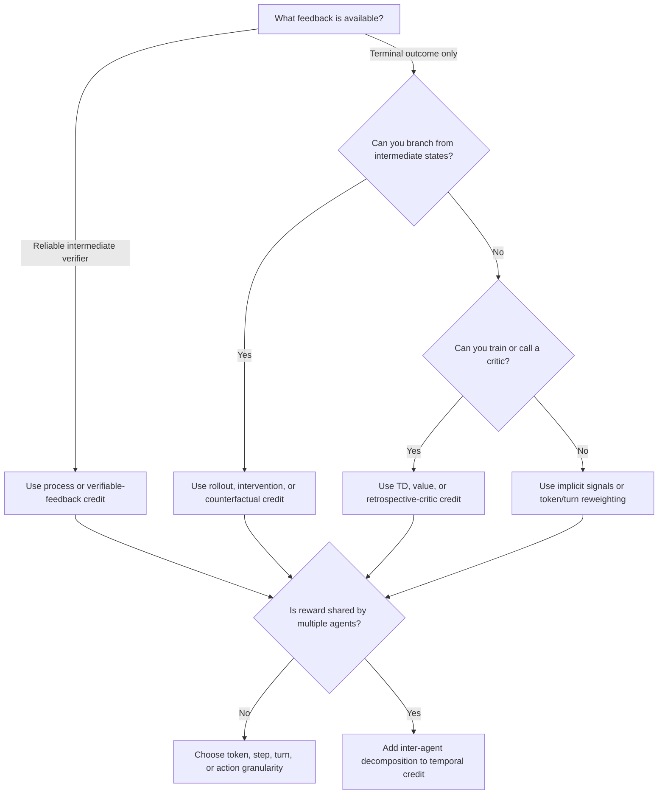

# Method Decision Guide

This guide maps system constraints to method families. It is not a benchmark ranking: results across papers are rarely directly comparable, and implementation cost can dominate small reported gains.

## Decision Tree

## Method Families

| Conditions | Suitable family | Representative methods | Main cost or risk |
|---|---|---|---|
| Intermediate states can be verified | Process rewards and verifiable-feedback shaping | SCRL, VPR, GVPO, Rubric-Grounded RL | Requires reliable local verification; proxy rewards can be gamed. |
| Branch or sibling rollouts are available | Monte Carlo, intervention, tree, or counterfactual methods | VinePPO, TEMPO, InT, HCAPO, CRAFT | Additional inference cost and branch-state design. |
| A value model or LLM critic is acceptable | TD, privileged critic, or retrospective critic | AgentPRM, SWEET-RL, CAPO, CriticSearch | Critic bias, training complexity, and extra model calls. |
| No learned critic is available, but gradients, likelihoods, or attribution proxies are accessible | Implicit signals and advantage reweighting | ITPO, DelTA, OAR, SC-GRPO, GRAIL, Progress Advantage | Attribution proxies may not identify causal responsibility. |
| One team reward covers several agents | Inter-agent decomposition plus intra-agent temporal credit | M-GRPO, C3, CCPO, LLM-MCA, SHARP, MAPPA, Dr. MAS | Combinatorial interventions and interaction effects. |

## Scenario Recipes

### Mathematical Reasoning

1. If intermediate subproblems can be verified, start with subproblem or process-level methods such as SCRL.
2. If continuations can be sampled from intermediate prefixes, compare rollout or intervention methods such as VinePPO, TEMPO, or InT.
3. If training must remain critic-free but gradients, grouped trajectories, or policy likelihoods are available, consider token or step reweighting such as DelTA, OAR, SC-GRPO, or GRAIL.
4. Validate whether the method improves reasoning rather than merely shifting response length or entropy.

### Coding Agents

1. Use compiler, test, shell, or execution feedback whenever it can verify intermediate actions.
2. Prefer turn/action credit when tool calls change environment state; token-only credit can miss the action boundary.
3. GVPO and structured action-credit methods are natural references when process-verifiable execution signals are available.
4. With terminal tests only, branch-based or retrospective methods can estimate which edit or command changed success probability.

### Web And GUI Agents

1. Model the task at turn or action granularity because observations and environment transitions occur between responses.
2. If a critic can observe privileged state during training, compare turn-level value or retrospective-critic methods.
3. Use verifiable process rewards only for checks that are stable under partial observability.
4. Audit recovery behavior: a late successful action should not erase credit for an earlier mistake that caused a long detour.

### Multi-Agent Systems

1. Separate **inter-agent credit** from **intra-agent temporal credit**.
2. For a small number of agents, counterfactual removal or Shapley-style methods may be feasible.
3. For larger systems, use scalable approximations such as hierarchical or agent-wise advantage normalization.
4. Check interaction effects: independently useful agents may be redundant together, while individually weak actions may be complementary.

## Final Selection Checklist

- Is the feedback source available during training, inference, or both?
- Does the method require environment snapshots or branchable states?
- How many extra rollouts or critic calls are required per trajectory?
- Is the assigned credit causal, predictive, or only correlational?
- Does the granularity match the environment's actual decision boundary?
- Is the comparison against trajectory-level reward controlled for compute?
- Are stability, reward hacking, and entropy effects reported separately from task success?

Filter the full metadata in [`data/papers.csv`](data/papers.csv) or [`data/papers.json`](data/papers.json) after selecting the relevant setting, granularity, and methodology.
